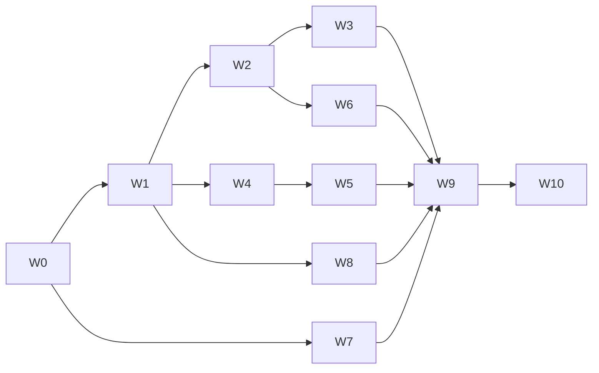

# Production Roadmap — путь к v1.0 для автономных агентов

Документ — единственный источник правды для планирования спринтов после релиза v0.3.0.
Аудитория: автономные агенты с полным циклом разработки (planning → implementation → review → release).

Связанные документы:

- [Agent_made.md](../Agent_made.md) — программный roadmap.
- [docs/current-status.md](current-status.md) — operational status.
- [docs/current-sprint.md](current-sprint.md) — активный спринт.
- [docs/release-status.md](release-status.md) — статус релиза.
- [docs/agent-feature-spine.json](agent-feature-spine.json) — feature_id registry.

## Принципы

1. Каждый спринт ≤ 1 неделя для одного агента (или эквивалент).
2. У каждого спринта: `goal`, `scope`, `exit_criteria` (машинно-проверяемые), `artifacts`, `feature_ids`.
3. Exit criteria всегда заканчиваются shell-командой или CI-job-ом, дающим `pass/fail`.
4. Спринты в одной волне могут идти параллельно, если нет явного `depends_on`.
5. После завершения спринта агент обязан: (a) обновить [docs/current-status.md](current-status.md), (b) добавить telemetry-entry, (c) обновить `release-status.md`, если меняется release scope.

## Глоссарий

- **Волна (Wave)** — логическая группа спринтов с общей целью.
- **Gate** — машинно-проверяемый критерий (CI-job, скрипт, schema validator).
- **Protocol** — абстрактный интерфейс, описанный в коде через `typing.Protocol`.
- **Stable contract** — JSON Schema `vN`, для которого зафиксирован deprecation policy.

---

## Обзор волн

| Wave | Тема | Спринты | Критический путь |
| --- | --- | --- | --- |
| W0 | Stabilize baseline | S0.1 | ✅ обязателен первым |
| W1 | Machine-readable contracts | S1.1, S1.2, S1.3 | ✅ |
| W2 | Demonolize | S2.1, S2.2, S2.3, S2.4 | ✅ |
| W3 | Plug-in providers | S3.1, S3.2, S3.3 | |
| W4 | Determinism | S4.1, S4.2, S4.3 | |
| W5 | Coverage expansion | S5.1, S5.2, S5.3 | |
| W6 | Operator surface (JSON CLI) | S6.1, S6.2 | ✅ |
| W7 | Security baseline | S7.1, S7.2 | ✅ |
| W8 | Harness consolidation | S8.1, S8.2 | |
| W9 | CI/CD automation | S9.1, S9.2, S9.3 | ✅ |
| W10 | v1.0 acceptance | S10.1 | финал |



---

## Wave 0 — Stabilize baseline

### Sprint S0.1 — Зелёный baseline и строгий линт

**Status:** completed 2026-05-28. Evidence: 5 подряд `\.venv\Scripts\python.exe -m unittest discover` (130 tests, OK), `\.venv\Scripts\python.exe -m ruff check src tests scripts`, `\.venv\Scripts\python.exe -m pyright`, `runTests tests/test_docx_converter.py`.

- **Goal:** устойчивый «зелёный» сигнал на main, строгие линт/тип-чек как required.
- **Scope:**
  - В [tests/](../tests/) ввести базовый `TestCase` или autouse-patch на `doc_converter.converters.docx._recognize_inline_glyph` с asset→symbol mapping; INLINE_GLYPH_CACHE clear before each test; добавить opt-in env-флаг `DOC_CONVERTER_TEST_REAL_GLYPHS=1` для одного «честного» теста.
  - В [pyproject.toml](../pyproject.toml) добавить `[tool.ruff]` (target-version py312, select=E,F,W,I,UP,B,SIM) и `[tool.pyright]` (`strict = true`, exclude legacy modules списком).
  - Починить найденные предупреждения или явно заглушить с TODO+feature_id.
  - В Windows CI шаги `ruff check src tests` и `pyright src` как required.
- **Exit criteria:**
  - `python -m unittest discover` ≥ 5 ранов подряд без падений (CI matrix включает rerun).
  - `ruff check src tests` — 0 ошибок.
  - `pyright src` — 0 errors.
  - В [docs/current-status.md](current-status.md) milestone «Baseline stabilized».
- **Artifacts:** обновлённые [tests init module](../tests/__init__.py) (или `conftest`-аналог для unittest), [pyproject.toml](../pyproject.toml), [.github/workflows/windows-ci.yml](../.github/workflows/windows-ci.yml).
- **feature_ids:** `quality.lint-strict`, `tests.docx-glyph-stable`.

---

## Wave 1 — Machine-readable contracts

### Sprint S1.1 — Contracts catalog

**Status:** completed 2026-05-28. Evidence: `\.venv\Scripts\python.exe -m unittest tests.test_contracts_stability`, `\.venv\Scripts\python.exe scripts\validate_run_package.py runs\formula-benchmark\runs\20260525T175329Z\cases\anchor-421-pr\output\runs\20260525T175329Z`, `\.venv\Scripts\python.exe scripts\validate_harness_assets.py`, full `unittest discover`, `ruff check`, `pyright`.

- **Goal:** все артефакты, потребляемые downstream, описаны как stable JSON Schema `v1` с deprecation policy.
- **Scope:**
  - Промоутить до stable: `processed-documents-catalog.v1`, `chunks.v1`, `chunk-source.v1`, `formula-recognition.v1`.
  - Создать `docs/contracts.md` с матрицей producer → consumer и deprecation rules (минимум 1 минор-релиз с warning).
  - Добавить тест `tests/test_contracts_stability.py`: сравнение текущих схем со «слепком» в `schemas/__snapshot__/` — изменение требует bump major.
- **Exit:** `python -m unittest tests.test_contracts_stability` green; `docs/contracts.md` существует и линкуется из [docs/downstream-handoff.md](downstream-handoff.md).
- **feature_ids:** `contracts-stable-v1`.

### Sprint S1.2 — Known formula patterns → data

**Status:** completed 2026-05-28. Evidence: `\.venv\Scripts\python.exe scripts\validate_known_formulas.py`, `\.venv\Scripts\python.exe -m unittest tests.test_known_formula_patterns tests.test_docx_converter`, full `unittest discover`, `ruff check`, `pyright`.

- **Goal:** убрать hard-coded MathType таблицу из кода.
- **Scope:**
  - Завести `schemas/formula-known-patterns.v1.schema.json`.
  - Перенести `_known_formula_representation` из DOCX formula text layer в [src/doc_converter/converters/docx/formulas/text.py](../src/doc_converter/converters/docx/formulas/text.py) и `samples/formulas/known-patterns.v1.json`.
  - Loader в `src/doc_converter/formulas/known.py` (после S2.1 — в подпакете), сейчас допустимо в существующем модуле.
  - Скрипт `scripts/export_known_formulas.py` + `scripts/validate_known_formulas.py`.
  - Тест `tests/test_known_formula_patterns.py` — параметризован по записям JSON.
- **Exit:** добавление новой формулы = правка JSON + автотест зелёный; в Python не правится ни одна строка.
- **depends_on:** S1.1.
- **feature_ids:** `formula-known-patterns-data`.

### Sprint S1.3 — Agent run metadata + universal validator

**Status:** completed 2026-05-29. Evidence: focused CLI metadata tests, legacy/fresh validation через `scripts\validate_run_package.py` и `scripts\validate_document_package.py`, full `unittest discover`, `ruff check`, `pyright`.

- **Goal:** каждый прогон трассируется до агента; каждый артефакт валидируется одной командой.
- **Scope:**
  - Расширить `schemas/run.v1.schema.json` обязательным блоком `agent_run_metadata { agent_id, agent_version, task_id, parent_run_id? }` (с graceful fallback для legacy).
  - Прокинуть метаданные через CLI флаги `--agent-id`, `--agent-version`, `--task-id`, `--parent-run-id`; в [src/doc_converter/runner.py](../src/doc_converter/runner.py) записать в run.json.
  - Создать `scripts/validate_document_package.py` (по аналогии с `validate_run_package.py`), валидирующий каждый `documents/<sha>/document.v1.json`.
- **Exit:** `python scripts/validate_run_package.py <runs/...>` и `python scripts/validate_document_package.py <runs/...>` оба возвращают JSON-отчёт с `status: ok`.
- **depends_on:** S1.1.
- **feature_ids:** `run.agent-metadata`, `validation.document-package`.

---

## Wave 2 — Demonolize

**Wave status:** completed 2026-05-30. Evidence: S2.1-S2.4 all closed with green focused/full validation; remaining architecture backlog on the critical path moved from converter coupling to structured CLI/operator surface.

### Sprint S2.1 — Split `converters/docx.py`

**Status:** completed 2026-05-29. Evidence: `src/doc_converter/converters/docx.py` заменён на package `converters/docx/`, package scope проходит лимит `< 800` строк на файл, focused DOCX + CLI/formula-recognition tests зелёные, full suite/ruff/pyright зелёные.

- **Goal:** убрать DOCX monolith > 800 строк и зафиксировать package split pattern без ломки public API.
- **Scope:** перевести DOCX route из monolith file в package entrypoint [src/doc_converter/converters/docx/__init__.py](../src/doc_converter/converters/docx/__init__.py) и smaller modules `converters/docx/`:
  - `pipeline.py` (convert_docx, body iteration, paragraph/table assembly);
  - `formulas/text.py` (representation, calc_expr, latex);
  - `formulas/known.py` (loader из S1.2);
  - `formulas/wmf.py` (WMF parsing, IR);
  - `inline_glyph.py` (recognizer + template renderer);
  - `__init__.py` сохраняет публичный API.
- **Exit:** `Get-ChildItem src\doc_converter\converters\docx -Recurse -File -Include *.py | Where-Object { (Get-Content $_.FullName).Length -gt 800 }` пусто; imports через `doc_converter.converters.docx` сохраняются; полный unittest green; `pyright src` clean.
- **depends_on:** S0.1, S1.2.
- **feature_ids:** `arch-docx-split`.

### Sprint S2.2 — Split `runner.py`

**Status:** completed 2026-05-29. Evidence: `src/doc_converter/runner.py` reduced to a 5-line compatibility wrapper, orchestration moved into `src/doc_converter/run/`, focused CLI/runner slices stayed green, full suite/ruff/pyright stayed green.

- **Goal:** orchestration ортогонален от I/O.
- **Scope:** подпакет `run/` с модулями `paths.py`, `resume.py`, `catalog.py`, `postprocess.py`, `orchestration.py`. Точка входа `run_convert_folder` re-exported.
- **Exit:** `runner.py` ≤ 200 строк (тонкий wrapper) или удалён в пользу `run/__init__.py`; unittest green.
- **depends_on:** S0.1.
- **feature_ids:** `arch-runner-split`.

### Sprint S2.3 — `tables/` shared package

**Status:** completed 2026-05-29. Evidence: shared parser moved to `src/doc_converter/tables/`, `pdf_text` and `pdf_scan` now import the same table normalizer, focused/full tests stayed green, fresh table-anchor run `runs\s23-table-anchors\runs\20260529T162149Z` kept `sample_009/018` expectations green.

- **Goal:** один table-нормализатор для PDF text/scan/будущих форматов.
- **Scope:** вынести dominant-width inference, continuation-merge, `table_structure_warning` в `src/doc_converter/tables/`. Обновить [pdf_text.py](../src/doc_converter/converters/pdf_text.py), [pdf_scan.py](../src/doc_converter/converters/pdf_scan.py).
- **Exit:** дубли в pdf_text/pdf_scan устранены; sample expectations `sample_009/018` без регрессий.
- **feature_ids:** `arch-tables-shared`.

### Sprint S2.4 — `ConverterProtocol` + route registry

**Status:** completed 2026-05-30. Evidence: `inventory.py` и `run/orchestration.py` теперь dispatch-ят через shared `doc_converter.converters` registry + `ConverterProtocol`, focused `tests.test_cli_smoke`/`tests.test_converter_registry`/`tests.test_inventory` slice зелёный, full suite (200 tests), `pip check`, `ruff`, `pyright` и `validate_harness_assets.py` зелёные.

- **Goal:** добавление нового конвертера = новый файл + одна строка регистрации.
- **Scope:** `src/doc_converter/converters/protocol.py` с `ConverterProtocol(detect, convert)`; registry в `converters/__init__.py`; [runner.py](../src/doc_converter/runner.py) больше не знает про конкретные форматы.
- **Exit:** добавить dummy `txt` конвертер за < 50 строк, тест зелёный; удалить после демонстрации (или оставить как baseline).
- **depends_on:** S2.1, S2.2, S2.3.
- **feature_ids:** `arch-converter-protocol`.

---

## Wave 3 — Plug-in providers

### Sprint S3.1 — `FormulaProvider Protocol`

**Status:** completed locally 2026-05-30. Evidence: `src/doc_converter/formulas/providers.py` now defines `FormulaProvider`, `LocalTesseractProvider`, `OpenRouterProvider` and `NullProvider`; `src/doc_converter/formula_recognition.py` uses a provider chain instead of hard-coded backend/provider branches; `tests/test_formula_recognition.py` covers each provider plus the `NullProvider` no-network integration path; full `unittest`, `ruff` and `pyright` stayed green.

- **Goal:** formula recognition pluggable.
- **Scope:** [src/doc_converter/formula_recognition.py](../src/doc_converter/formula_recognition.py) расщепить на:
  - `FormulaProvider Protocol` (`predict(asset, ctx) -> FormulaPrediction`);
  - реализации `LocalTesseractProvider`, `OpenRouterProvider`, `NullProvider`;
  - провайдер выбирается через config + env, fallback chain — данные, не код.
- **Exit:** unit-тесты на каждый provider; интеграционный тест с `NullProvider` стабильно зелёный без сети.
- **depends_on:** S2.2.
- **feature_ids:** `providers-formula-protocol`.

### Sprint S3.2 — `OCRBackend Protocol` и `CatalogWriter Protocol`

**Status:** completed locally 2026-05-31. Evidence: `src/doc_converter/ocr/backends.py` now defines `OcrmypdfBackend`, `NullOcrBackend` and the `OCRBackend` protocol; `src/doc_converter/run/catalog_writers.py` introduces `JsonCatalogWriter`, `XlsxCatalogWriter` and the `CatalogWriter` protocol; `ConverterOptions` now serializes `ocr_backend` and `catalog_writers` into `run.json`; `tests/test_pdf_scan_converter.py`, `tests/test_cli_smoke.py` and `tests/test_config.py` verify explicit null OCR backend, json-only catalog output and unchanged default behavior; full `unittest`, `ruff` and `pyright` stayed green.

- **Goal:** OCR backend и catalog writer тоже plug-in.
- **Scope:** аналогично S3.1; `OcrmypdfBackend`, `NullOcrBackend`; `JsonCatalogWriter`, `XlsxCatalogWriter`.
- **Exit:** замена backend через config работает в тесте.
- **depends_on:** S3.1.
- **feature_ids:** `providers-ocr-protocol`, `providers-catalog-protocol`.

### Sprint S3.3 — Secret redaction guarantee

**Status:** completed locally 2026-05-31. Evidence: `src/doc_converter/redaction.py` introduces recursive env-value redaction for keys matching `*API_KEY*/*TOKEN*/*SECRET*`; run/package serialization boundaries in `src/doc_converter/run/orchestration.py`, `src/doc_converter/run/logging.py`, `src/doc_converter/run/catalog.py` and `src/doc_converter/formula_recognition.py` now write redacted payloads; `tests/test_provider_secret_redaction.py` scans temp run artifacts and formula-recognition sidecars for raw env-secret values; full `unittest`, `ruff` and `pyright` stayed green.

- **Goal:** ни один secret не утекает в артефакты.
- **Scope:** утилита `redact_secrets(obj, env)`; вызов на границе записи `run.json`/`manifest`/`formula-recognition.jsonl`; тест `tests/test_provider_secret_redaction.py` сканирует все артефакты test-runs на совпадения со значениями env-vars `*API_KEY*/*TOKEN*/*SECRET*`.
- **Exit:** тест зелёный; CI-gate.
- **depends_on:** S3.1.
- **feature_ids:** `security-secret-redaction`.

---

## Wave 4 — Determinism

### Sprint S4.1 — Stable ordering

**Status:** completed locally 2026-05-31. Evidence: [src/doc_converter/inventory.py](../src/doc_converter/inventory.py) now sorts finalized supported/unsupported inventory records and duplicate groups by deterministic path key plus `sha256`; [tests/test_inventory.py](../tests/test_inventory.py) proves duplicate-primary selection no longer depends on iterator order; [tests/test_run_determinism.py](../tests/test_run_determinism.py) forces two different `_iter_input_files` orders and still gets identical clean-run `manifest.jsonl`.

- **Goal:** идентичный input → идентичный output (до timestamps).
- **Scope:** заменить `os.walk` на детерминированный обход с `sorted`; зафиксировать сортировку по `(source_path, sha256)` в [src/doc_converter/inventory.py](../src/doc_converter/inventory.py).
- **Exit:** тест `tests/test_run_determinism.py`: два rerun дают идентичные `manifest.jsonl` после нормализации timestamps.
- **feature_ids:** `determinism-ordering`.

### Sprint S4.2 — Incremental formula benchmark

- **Goal:** benchmark выполняется инкрементально.
- **Scope:** ключ кеша = `sha256(asset) + sha256(manifest_entry) + benchmark_version`; пропуск неизменённых записей; required_gate всё ещё проверяется по полному набору.
- **Exit:** rerun без изменений < 30 сек локально; первый run и любой rerun с изменением gold/manifest — полная пересборка.
- **depends_on:** S1.1.
- **feature_ids:** `formula.benchmark-incremental`.

### Sprint S4.3 — Font bundling

- **Goal:** убрать зависимость от системных шрифтов.
- **Scope:** добавить минимальный набор лицензионно-чистых шрифтов в `assets/fonts/`; inline-glyph renderer ищет сначала там; при отсутствии — явный понятный fail с подсказкой.
- **Exit:** real-renderer тест (S0.1 opt-in) зелёный на чистой Windows VM без MS Office.
- **depends_on:** S2.1.
- **feature_ids:** `determinism.font-bundle`.

---

## Wave 5 — Coverage expansion

### Sprint S5.1 — Formula corpus expansion

- **Goal:** benchmark coverage ≥ 80 % calc_expr и ≥ 70 % native.
- **Scope:** расширить `samples/formula-benchmark.manifest.jsonl` и `samples/expected/formulas/` реальными формулами из 1/421/521/534/812/904/пр; поднять пороги в `samples/formula-benchmark.thresholds.json`.
- **Exit:** `python scripts/run_formula_benchmark.py` зелёный при новых порогах.
- **depends_on:** S1.2, S4.2.
- **feature_ids:** `formula.corpus-expansion`.

### Sprint S5.2 — Negative samples

- **Goal:** покрыть «несчастливые пути».
- **Scope:** добавить в `samples/manifest.table-anchors.jsonl` сэмплы: без таблиц, с битой WMF, защищённый PDF; ожидаемый `review_required` reason.
- **Exit:** `python scripts/validate_sample_expectations.py` зелёный.
- **depends_on:** S2.3.
- **feature_ids:** `tests.negative-samples`.

### Sprint S5.3 — Property-based tests + test-cost reduction

- **Goal:** дешёвые регрессионные тесты + быстрое CI.
- **Scope:**
  - `hypothesis` strategies для formula text normalizer и table row merger.
  - `tests/fixtures/docx_factories.py` с переиспользуемыми builders и module-scope cached documents.
- **Exit:** локальный `unittest discover` < 60 сек; CI test stage < 4 мин.
- **feature_ids:** `tests.property-based`, `tests.docx-fixtures`.

---

## Wave 6 — Operator surface (JSON CLI)

### Sprint S6.1 — Structured CLI

**Status:** completed 2026-05-30. Evidence: `schemas/cli-result.v1.schema.json` добавлена, `tests/test_cli_smoke.py` покрывает каждый subcommand и каждый exit code, `runTests tests/test_cli_smoke.py` дал 29/29, полный `runTests` дал 203/0, `ruff` и `pyright` зелёные.

- **Goal:** агенты принимают решения без парсинга текста.
- **Scope:**
  - [src/doc_converter/cli.py](../src/doc_converter/cli.py): флаг `--output-format=json` (default — human) с фиксированной схемой `schemas/cli-result.v1.schema.json`.
  - Exit code matrix: `0 ok`, `10 partial`, `20 review_required`, `30 input_invalid`, `40 environment_invalid`, `50 internal_error`.
  - Subcommands:
    - `document-converter doctor` — проверка OCR runtime, шрифтов, OpenRouter reachability, версий схем; JSON-отчёт.
    - `document-converter dry-run` — inventory + classification, без записи.
- **Exit:** smoke-тесты на каждый subcommand и каждый exit code; CLI-schema валидируется в тесте.
- **depends_on:** S2.2.
- **feature_ids:** `operator.cli-json`, `operator.doctor`, `operator.dry-run`.

### Sprint S6.2 — Structured logs and telemetry

Status: completed (2026-05-30). Evidence: added `schemas/log.v1.schema.json`, introduced central `RuntimeLogger` in `src/doc_converter/run/logging.py`, every run now emits `runs/<id>/telemetry.jsonl`, `scripts/validate_run_package.py` validates telemetry, `runTests tests/test_cli_smoke.py` passed `29/29`, in-process `validate_run_package.py` smoke on a fresh run package passed, `runTests` passed `203/0`, `ruff` and `pyright` passed.

- **Goal:** 100 % событий runtime — structured JSONL по схеме `log.v1`.
- **Scope:** `schemas/log.v1.schema.json`; logger adapter; `runs/<id>/telemetry.jsonl` со схемой; legacy текстовые логи → опционально через flag.
- **Exit:** валидатор `scripts/validate_run_package.py` дополнен проверкой telemetry/logs; зелёный.
- **depends_on:** S6.1.
- **feature_ids:** `operator.structured-logs`.

---

## Wave 7 — Security baseline

### Sprint S7.1 — Threat model и input hardening

Status: completed (2026-05-30). Evidence: added `docs/security.md`, hardened `src/doc_converter/run/paths.py` against symlink-based path confusion for `input_dir`/`output_dir`/`runs_dir`, added DOCX archive entry/uncompressed-size admission checks in `src/doc_converter/converters/docx/pipeline.py`, added WMF blob/record-count limits in `src/doc_converter/converters/docx/formulas/wmf.py`, `runTests tests/test_docx_converter.py tests/test_run_paths.py` passed `88/88`, `.\.venv\Scripts\python.exe -m unittest discover -v` passed `156` tests with `skipped=4`, `ruff` and `pyright` passed.

- **Goal:** безопасная обработка untrusted documents.
- **Scope:**
  - `docs/security.md`: модель угроз, список subprocess, политика по шрифтам и paths.
  - WMF parser: size/record-count limits в [src/doc_converter/converters/docx/formulas/wmf.py](../src/doc_converter/converters/docx/formulas/wmf.py).
  - OOXML: лимит на zip entries и распакованный размер.
  - `runner._validate_startup_paths`: symlink resolution + строгий allowlist `input_dir`/`output_dir`/`runs_dir`.
- **Exit:** тесты с malicious sample (zip-bomb DOCX, oversized WMF) — graceful reject; `docs/security.md` ревьюнут.
- **depends_on:** S0.1.
- **feature_ids:** `security.input-hardening`, `security.threat-model`.

### Sprint S7.2 — Secret scan CI

**Status:** completed 2026-05-30. Evidence: `windows-ci` теперь устанавливает Gitleaks и выполняет `gitleaks git --config .gitleaks.toml --exit-code 1 .`; local validation подтвердила `clean_exit = 0` на текущем repo и `canary_exit = 1` в synthetic git repo с env-style synthetic canary assignment.

- **Goal:** утечки не попадают в репозиторий.
- **Scope:** gitleaks или trufflehog в CI; конфиг с allowlist для test fixtures; required check.
- **Exit:** CI-job зелёный на чистом репо; искусственно вставленный API key валится.
- **depends_on:** S3.3.
- **feature_ids:** `security.secret-scan`.

---

## Wave 8 — Harness consolidation

### Sprint S8.1 — State layer slim-down

- **Goal:** новый агент-онбординг — ≤ 5 текстовых и ≤ 3 JSON.
- **Scope:** переместить исторические agent-* файлы в `docs/archive/`; оставить активными: `AGENTS.md`, `current-status.md`, `current-sprint.md`, `release-status.md`, `production-roadmap.md` + JSON `agent-feature-spine.json`, `agent-quality-scorecard.v1.json`, `agent-weekly-eval.v1.json`.
- **Exit:** `docs/agent-bootstrap-contract.md` обновлён и сокращён; `scripts/validate_harness_assets.py` зелёный.
- **feature_ids:** `harness.slim-state`.

### Sprint S8.2 — Machine-readable guardrails и exit checklist

- **Goal:** оркестратор инфорсит guardrails и exit-checklist программно.
- **Scope:**
  - Перенести `agent-guardrails.md` и `agent-stop-budgets.md` в `*.v1.json` со схемой.
  - `scripts/validate_session_exit.py` проверяет exit JSON.
- **Exit:** скрипт зелёный на текущем main; CI-job опционально.
- **depends_on:** S8.1.
- **feature_ids:** `harness.machine-guardrails`.

---

## Wave 9 — CI/CD automation

### Sprint S9.1 — PR-gates и branch protection

**Status:** completed 2026-05-30. Evidence: `main` branch protection now requires `secret-scan`, `lint`, `typecheck`, `unit-tests`, `harness-validator`, `formula-benchmark-gate`, `document-package-validator` и `release-smoke` with `strict = true` and `required_approving_review_count = 0`; PR template enforces feature/state/validation closeout; `.github/workflows/autonomous-pr-auto-merge.yml` lives on `main` and same-repo non-draft PRs with label `agent:autonomous` can merge automatically after green checks.

- **Goal:** автономный merge при зелёных gates.
- **Scope:**
  - PR template требует feature_id, обновлённый `current-status.md`, telemetry append.
  - Required checks на main: lint, type, unittest, harness validator, formula benchmark required gate, secret scan, document-package validator.
  - Auto-merge для PR с label `agent:autonomous` при всех зелёных gates.
- **Exit:** demo PR от агента merge-ится без человека.
- **depends_on:** S0.1, S1.3, S3.3, S7.2.
- **feature_ids:** `ci-pr-gates`, `ci-auto-merge`.

### Sprint S9.2 — Nightly full e2e

**Status:** in_progress 2026-05-30. Initial evidence: `.github/workflows/nightly-full-e2e.yml`, `samples/manifest.table-anchors.ci.jsonl`, `scripts/create_nightly_failure_issue.py`.

- **Goal:** ежедневный полный регресс.
- **Scope:** nightly job: synthetic-e2e + full formula benchmark monitor on hosted runners (`--no-thresholds`) + CI-safe formula required gate + repo-tracked table anchors + portable package build + EXE smoke. Failure → auto-issue с привязкой к latest merged PR и `agent_id` из PR body с fallback на `head_ref`/author.
- **Exit:** 7 ночей подряд успешный run или auto-issue с детальной диагностикой.
- **depends_on:** S9.1.
- **feature_ids:** `ci-nightly-e2e`.

### Sprint S9.3 — Release automation

**Status:** completed locally 2026-05-30. Evidence: `.github/workflows/release.yml` publishes GitHub Releases on `v*` tags, `scripts/package-release.ps1` now renders `release-notes.md` from `CHANGELOG.md` through `scripts/render_release_notes.py` / `src/doc_converter/release_notes.py`, `tests/test_release_notes.py` covers exact-version and nightly fallback behavior, and local smoke `powershell -ExecutionPolicy Bypass -File scripts\package-release.ps1 -Name DocumentConverter -Version 0.3.0-nightly -SkipBuild` generated a changelog-backed release bundle.

- **Goal:** релиз без ручного шага.
- **Scope:** tag `v0.x.y` → build portable + checksum + GitHub Release + release-notes из CHANGELOG, который пишут агенты.
- **Exit:** релиз `v0.3.1` (или ближайший) уходит автоматически.
- **depends_on:** S9.1.
- **feature_ids:** `ci-release-automation`.

---

## Wave 10 — v1.0 acceptance

### Sprint S10.1 — v1.0 gate

- **Goal:** релиз v1.0.
- **Exit criteria (все одновременно):**
  - Все 4 route стабильны; formula benchmark coverage ≥ 80 % calc / ≥ 70 % native (`samples/formula-benchmark.thresholds.json`).
  - `docs/security.md` ревьюнут, S7.x закрыты.
  - Все Protocol-абстракции (`Converter`, `Formula`, `OCR`, `Catalog`) имеют ≥ 2 реализации каждая.
  - Контракты `v1` финализированы; `v2`-эволюция — только через explicit deprecation.
  - 4 недели telemetry подряд без unresolved regressions.
  - Portable EXE smoke + package gate зелёные 30 ранов подряд.
- **Artifacts:** tag `v1.0.0`, release notes, обновлённый `release-status.md` с verdict «v1.0 GA».
- **depends_on:** W0–W9 завершены.
- **feature_ids:** `release.v1`.

---

## Tracking template для спринта

При старте спринта агент создаёт checkpoint по шаблону:

```yaml
sprint_id: S2.1
goal: "Split converters/docx.py"
feature_ids: [arch-docx-split]
depends_on: [S0.1, S1.2]
status: in_progress     # not_started | in_progress | blocked | done
started_at: "2026-MM-DDTHH:MM:SSZ"
exit_criteria:
  - id: file_size_limit
    check: "Get-ChildItem src -Recurse -File -Include *.py | Where-Object { (Get-Content $_.FullName).Length -gt 800 } | Measure-Object | Select -Expand Count"
    expected: 0
    status: pending     # pending | passed | failed
  - id: unittest_green
    check: "python -m unittest discover"
    expected: "OK"
    status: pending
  - id: pyright_clean
    check: "pyright src"
    expected: "0 errors"
    status: pending
notes: []
```

Поле `status` в exit_criteria и в спринте обновляется после каждой substantive правки.
После `status: done` агент:

1. Обновляет [docs/current-status.md](current-status.md) (новый milestone).
2. Дописывает [docs/agent-telemetry.v1.jsonl](agent-telemetry.v1.jsonl).
3. Обновляет [docs/release-status.md](release-status.md), если scope релиза затронут.
4. Закрывает соответствующие `feature_id` в [docs/agent-feature-spine.json](agent-feature-spine.json) (если применимо).

## История изменений документа

- 2026-05-28 — первичная версия, согласована со статусом v0.3.0.
